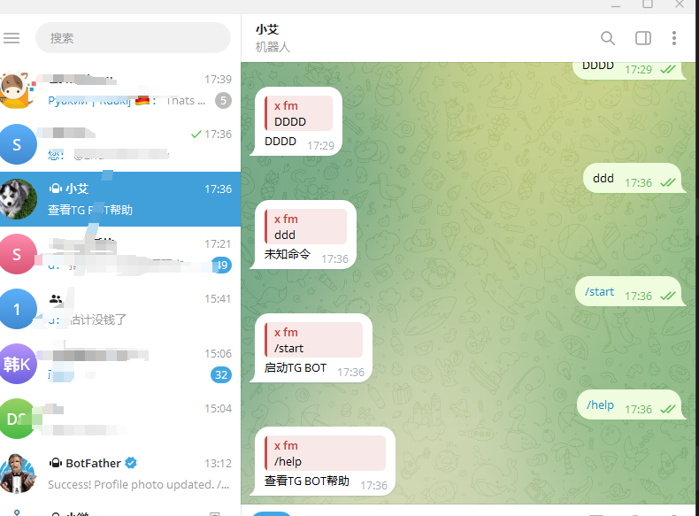
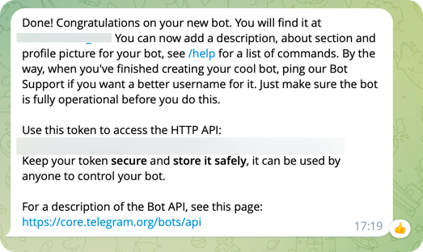
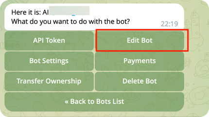
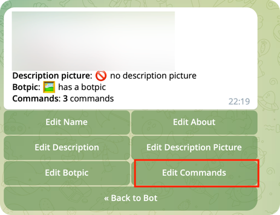
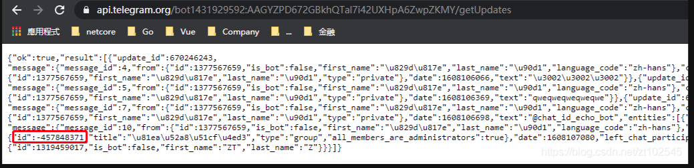

## Telegram-Bot
#### 介绍
telegram 机器人
#### 示例

#### 使用
> 把变量`token` 和 `username` 替换为自己的内容
##### 本地
如果是在本地跑的话，需要开启代理 vpn
##### Replit
不要试图在国内的服务器跑，国内服务器连接不是`telegram`
#### 创建 Telegram Bot
先给 [BotFather](https://t.me/BotFather) 发送指令
```text
/newbot
```
发送机器人名字
> 上一步后回应:
Alright, a new bot. How are we going to call it? Please choose a name for your bot.
```text
比如叫 小艾 就发送 小艾
```
给机器人起用户名
> 上一步回复：Good. Now let's choose a username for your bot. It must end in `bot`. Like this, for example: TetrisBot or tetris_bot.
```text
发送一个机器人用户名 必须以 _bot 结尾,如果有这个用户名了会告诉你重新发送
比如 chattest_bot
```
返回token
> 要保存`token` 跑项目的时候需要使用 在 `Use this token to access the HTTP API:`下面



#### 设置指令 - 机器人设置
> 发送这个指令后 同样需要选择自己机器人的用户名 点击 `edit bot`
```text
/mybots
```


选择编辑指令



发送指令
> 如果需要更多可以类似这样添加 下面示例只针对本项目
```text
start - 开始使用AI
picture - 随机图片
help - 滴博主
```
#### 设置指令 - java 代码
```java
 // 注册菜单 如果已设置 可以取消
 bot1.registerCommands();
```


#### 获取群组 chatId
将创建的机器人拉入群组，然后群里做下操作，比例拉人或者踢人。
然后访问地址：https://api.telegram.org/bot{Token}/getUpdates
这个链接可以查看到chatid（通过机器人发消息需要用到chatid），这个Token要换成你自己的，chatid一般都是负数的那个。

#### 主动向群组发送消息
通过HTTP方式发送消息，地址为：
https://api.telegram.org/bot{Token}/sendMessage?chat_id={chatid}&text={massage}